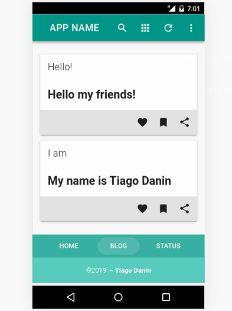

# VueJs with Express

[](https://travis-ci.org/TiagoDanin/VueJs-with-Express) [](https://npmjs.org/package/vuejs-with-express) [](https://npmjs.org/package/vuejs-with-express) [](https://npmjs.org/package/vuejs-with-express) [](https://github.com/xojs/xo) 

Example PWA + Nuxt + Vue + Axios + Express

<p align="center"></p>

## Installation

Module available through the [npm registry](https://www.npmjs.com/). It can be installed using the  [`npm`](https://docs.npmjs.com/getting-started/installing-npm-packages-locally) or [`yarn`](https://yarnpkg.com/en/) command line tools.

```sh
# NPM
npm install vuejs-with-express --save
# Or Using Yarn
yarn add vuejs-with-express
```

## Usage

```sh
# Start
yarn dev
```

## Tests

To run the test suite, first install the dependencies, then run `test`:

```sh
# NPM
npm test
# Or Using Yarn
yarn test
```

## Dependencies

<details>
	<summary><a href="https://ghub.io/@nuxtjs/axios">@nuxtjs/axios</a>: Secure and easy axios integration with Nuxt.js</summary>
	<b>Author</b>: alexchopin, atinux, clarkdo, galvez, nuxt.bot, pi0</br>
	<b>License</b>: MIT</br>
	<b>Version</b>: ^5.9.0
</details>
<details>
	<summary><a href="https://ghub.io/@nuxtjs/pwa">@nuxtjs/pwa</a>: Supercharge Nuxt with a heavily tested, updated, zero-config and stable PWA solution!</summary>
	<b>Author</b>: galvez, nuxt.bot, clarkdo, pi0, atinux, alexchopin</br>
	<b>License</b>: </br>
	<b>Version</b>: 3.0.0-beta.19
</details>
<details>
	<summary><a href="https://ghub.io/@nuxtjs/vuetify">@nuxtjs/vuetify</a>: Vuetify Module for Nuxt.js</summary>
	<b>Author</b>: aldarund, alexchopin, atinux, clarkdo, galvez, kevinmarrec, nuxt.bot, pi0</br>
	<b>License</b>: MIT</br>
	<b>Version</b>: ^1.6.3
</details>
<details>
	<summary><a href="https://ghub.io/axios">axios</a>: Promise based HTTP client for the browser and node.js</summary>
	<b>Author</b>: Matt Zabriskie</br>
	<b>License</b>: MIT</br>
	<b>Version</b>: ^0.19.0
</details>
<details>
	<summary><a href="https://ghub.io/body-parser">body-parser</a>: Node.js body parsing middleware</summary>
	<b>Author</b>: dougwilson</br>
	<b>License</b>: MIT</br>
	<b>Version</b>: 1.19.0
</details>
<details>
	<summary><a href="https://ghub.io/cookie-session">cookie-session</a>: cookie session middleware</summary>
	<b>Author</b>: fishrock123, tjholowaychuk, dougwilson, jongleberry, defunctzombie</br>
	<b>License</b>: MIT</br>
	<b>Version</b>: 1.3.3
</details>
<details>
	<summary><a href="https://ghub.io/cross-env">cross-env</a>: Run scripts that set and use environment variables across platforms</summary>
	<b>Author</b>: Kent C. Dodds</br>
	<b>License</b>: MIT</br>
	<b>Version</b>: ^6.0.3
</details>
<details>
	<summary><a href="https://ghub.io/express">express</a>: Fast, unopinionated, minimalist web framework</summary>
	<b>Author</b>: TJ Holowaychuk</br>
	<b>License</b>: MIT</br>
	<b>Version</b>: ^4.17.1
</details>
<details>
	<summary><a href="https://ghub.io/nuxt">nuxt</a>: A minimalistic framework for server-rendered Vue.js applications (inspired by Next.js)</summary>
	<b>Author</b>: atinux</br>
	<b>License</b>: MIT</br>
	<b>Version</b>: ^2.11.0
</details>
<details>
	<summary><a href="https://ghub.io/vue">vue</a>: Reactive, component-oriented view layer for modern web interfaces.</summary>
	<b>Author</b>: Evan You</br>
	<b>License</b>: MIT</br>
	<b>Version</b>: ^2.6.10
</details>
<details>
	<summary><a href="https://ghub.io/vuetify">vuetify</a>: Vue Material Component Framework</summary>
	<b>Author</b>: John Leider</br>
	<b>License</b>: MIT</br>
	<b>Version</b>: 2.1.15
</details>

## Dev Dependencies

<details>
	<summary><a href="https://ghub.io/nodemon">nodemon</a>: Simple monitor script for use during development of a node.js app.</summary>
	<b>Author</b>: Remy Sharp</br>
	<b>License</b>: MIT</br>
	<b>Version</b>: ^2.0.2
</details>
<details>
	<summary><a href="https://ghub.io/xo">xo</a>: JavaScript linter with great defaults</summary>
	<b>Author</b>: Sindre Sorhus</br>
	<b>License</b>: MIT</br>
	<b>Version</b>: ^0.25.3
</details>

## Contributors

Pull requests and stars are always welcome. For bugs and feature requests, please [create an issue](https://github.com/TiagoDanin/VueJs-with-Express/issues). [List of all contributors](https://github.com/TiagoDanin/VueJs-with-Express/graphs/contributors).

## Thanks

- [danijelmartinek](https://github.com/danijelmartinek/nuxt.js-express-vuetify): Fork/Inspiration in nuxt.js-express-vuetify

## License

[MIT](LICENSE) © [Tiago Danin](https://tiagodanin.github.io)